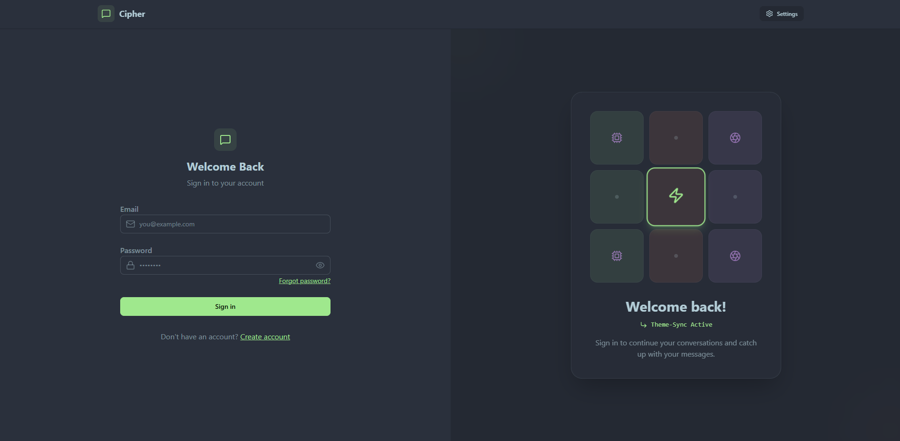
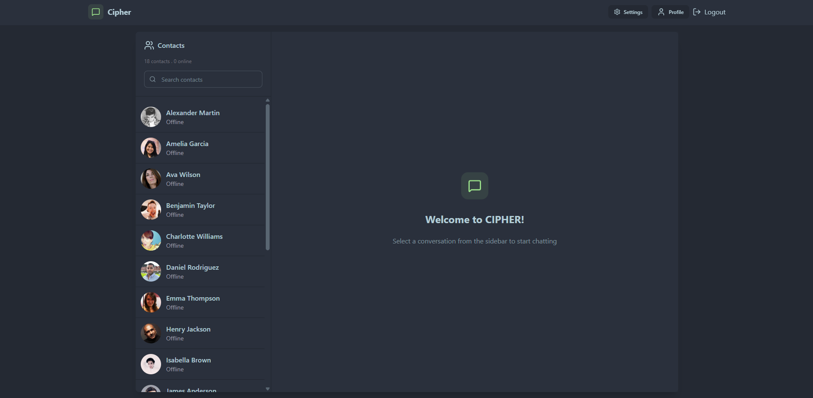
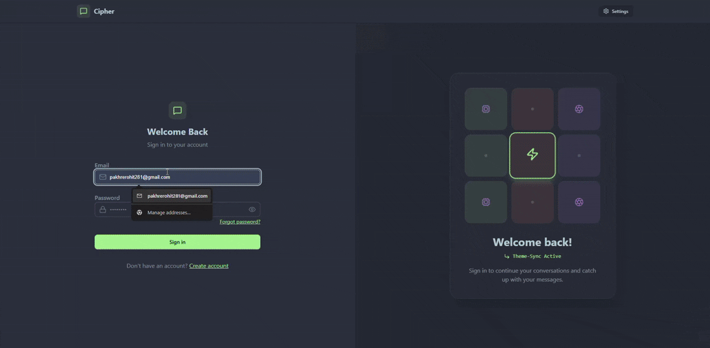

# Cipher - Real-Time Chat Application


Cipher is a modern and feature-rich real-time chat application built with the MERN stack (MongoDB, Express.js, React, Node.js) and integrated with Socket.io for instant messaging. It provides a seamless and interactive user experience with a clean and intuitive user interface.

## Features

-   **Real-Time Messaging:** Instantaneous message delivery and updates using WebSockets.
-   **User Authentication:** Secure user sign-up and login functionality with JWT (JSON Web Tokens).
-   **Password Reset:** Ability for users to reset their password via email.
-   **User Profiles:** View and manage user profiles.
-   **Typing Indicators:** See when other users are typing a message.
-   **Message Status:** Track the status of your messages (sent, delivered, read).
-   **Light/Dark Mode:** Switch between light and dark themes for better user experience.
-   **Cloud-Based Image Uploads:** Utilizes Cloudinary for efficient and scalable image handling.
-   **Responsive Design:** Fully responsive user interface that works on all screen sizes.

## Sneak Peak📸



## Video📹


## Tech Stack

### Frontend

-   **Framework:** React
-   **Build Tool:** Vite
-   **Styling:** Tailwind CSS & daisyUI
-   **State Management:** Redux Toolkit
-   **Routing:** React Router DOM
-   **HTTP Client:** Axios
-   **Form Management:** React Hook Form & Zod
-   **Real-time Communication:** Socket.IO Client
-   **UI Icons:** Lucide React
-   **Notifications:** React Hot Toast

### Backend

-   **Framework:** Express.js
-   **Database:** MongoDB with Mongoose
-   **Real-time Communication:** Socket.IO
-   **Authentication:** JSON Web Tokens (JWT)
-   **Password Hashing:** bcrypt.js
-   **Email Service:** Nodemailer
-   **File Storage:** Cloudinary
-   **Environment Variables:** Dotenv

## Getting Started

Follow these instructions to get a copy of the project up and running on your local machine for development and testing purposes.

### Prerequisites

-   Node.js (v18.x or higher)
-   pnpm (or npm/yarn)
-   MongoDB (local installation or a cloud-hosted instance like MongoDB Atlas)

### Installation

1.  **Clone the repository:**
    ```sh
    git clone https://github.com/Rohit-Pakhre09/Cipher.git
    cd cipher
    ```

2.  **Install backend dependencies:**
    ```sh
    cd backend
    pnpm install
    ```

3.  **Install frontend dependencies:**
    ```sh
    cd ../frontend
    pnpm install
    ```

### Configuration

1.  **Backend Environment Variables:**
    -   In the `backend` directory, create a `.env` file by copying the `.env.example` (if available) or by creating a new one.
    -   Add the following environment variables:
        ```
        PORT=5000
        MONGO_URI=<your_mongodb_connection_string>
        JWT_SECRET=<your_jwt_secret>
        CLOUDINARY_CLOUD_NAME=<your_cloudinary_cloud_name>
        CLOUDINARY_API_KEY=<your_cloudinary_api_key>
        CLOUDINARY_API_SECRET=<your_cloudinary_api_secret>
        EMAIL_HOST=<your_email_host>
        EMAIL_PORT=<your_email_port>
        EMAIL_USER=<your_email_user>
        EMAIL_PASS=<your_email_password>
        ```

2.  **Frontend Environment Variables:**
    -   In the `frontend` directory, create a `.env` file.
    -   Add the following environment variable to point to your backend server:
        ```
        VITE_BASE_URL=http://localhost:5000
        ```

### Running the Application

1.  **Start the backend server:**
    ```sh
    cd backend
    pnpm run dev # or node src/index.js
    ```

2.  **Start the frontend development server:**
    ```sh
    cd ../frontend
    pnpm run dev
    ```

The application should now be running. Open your browser and navigate to the address provided by Vite (usually `http://localhost:5173`).

## Project Structure

The project is organized into two main folders: `frontend` and `backend`.

```
cipher/
├── backend/
│   ├── src/
│   │   ├── controllers/
│   │   ├── lib/
│   │   ├── middleware/
│   │   ├── models/
│   │   ├── routes/
│   │   └── utils/
│   ├── .env
│   └── package.json
└── frontend/
    ├── src/
    │   ├── assets/
    │   ├── components/
    │   ├── hooks/
    │   ├── lib/
    │   ├── pages/
    │   └── store/
    ├── public/
    └── package.json

```

## License

This project is licensed under the ISC License - see the [LICENSE](LICENCE) file for details.

---

### **Author**

-   **Deepak**
    -   LinkedIn: [@Rohit Pakhre](https://www.linkedin.com/in/rohit-pakhre/)
    -   GitHub: [@Rohit Pakhre](https://github.com/Rohit-Pakhre09)

### **Show your support**

Give a ⭐️ if you like this project!
